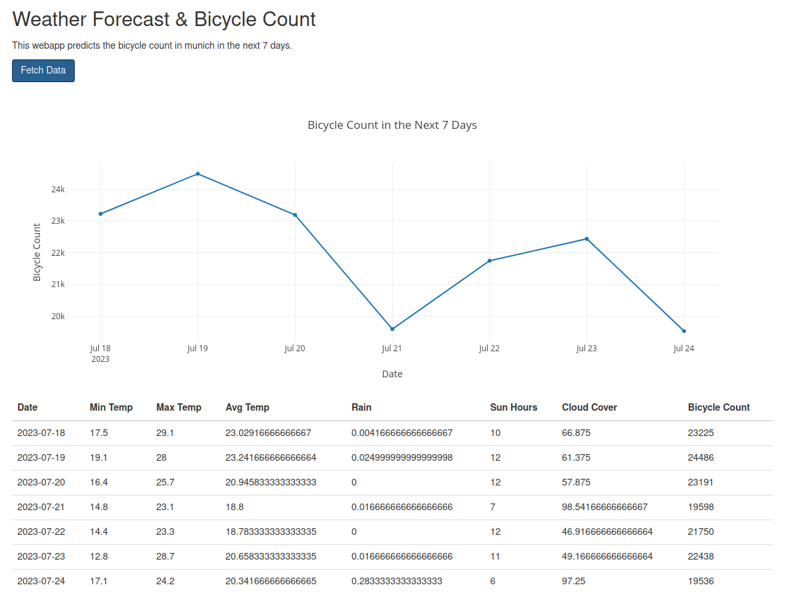

# Data Science Project - Predicting cyclists in Munich

This project uses opendata of the city of Munich to predict the expected number of cyclists for a given day using the weather forecast and historic data.

Blogpost:

https://medium.com/@jonas.hahn/open-data-predicting-cyclist-traffic-in-munich-4acf1c11c0ed

## Getting Started

To run the webapp via docker execute the following commands:

```
docker-compose up
```

The webapp is then available at http://localhost:8080



## Project Structure

The project is structured as follows:

* `blogpost` : Contains the blogpost as markdown file and the images used in the blogpost on medium.com
* `datasources` : Contains the scripts to download and clean the data.
* `explorations` : Contains the jupyter notebooks used for data exploration and model experimentation.
* `models` : Contains the finalized version of the model training pipeline and the trained model.
* `webapp` : Contains the webapp to predict the number of cyclists for a given day.

## Train the model

To train the model, execute the following command:

```
python3 train_model.py --inputdata ../datasources/munich-bicycle-counting-stations/cleaned/bicycle-counting-station-daily.json
```

## Datasources

Every datasource has its own folder in the `datasources` folder, which contains detailed documentation and scripts or jupyter notebooks to download and clean the data.

* **Munich Bicycle Counting Stations** : "Bicycle counting stations" were established in Munich in 2008 for continuous monitoring of increasing bicycle traffic. This is the main dataset used, you find details in the datasets README

### Munich Bicycle Counting Stations

See the readme file `datasources/munich-bicycle-counting-stations/README.md`

