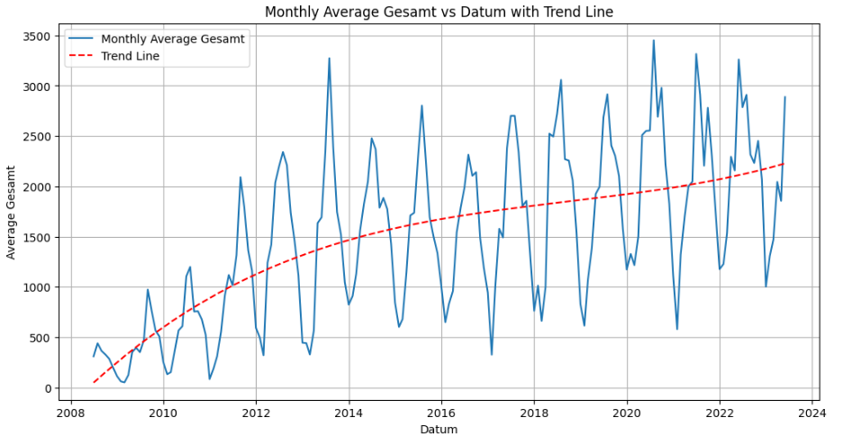
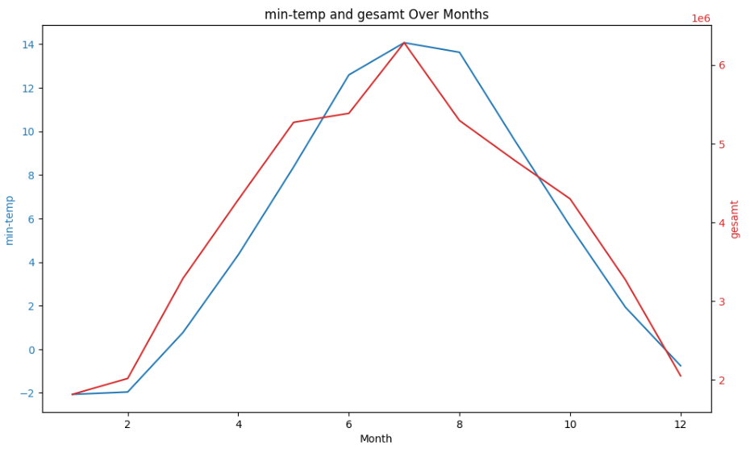
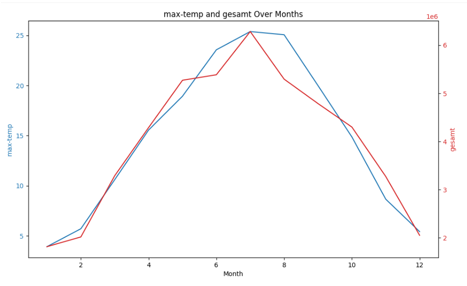
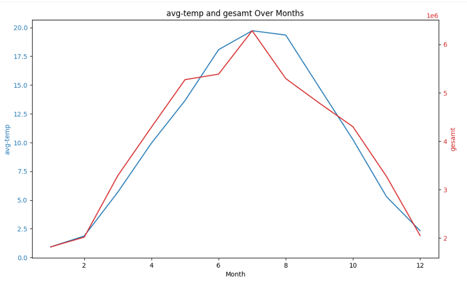
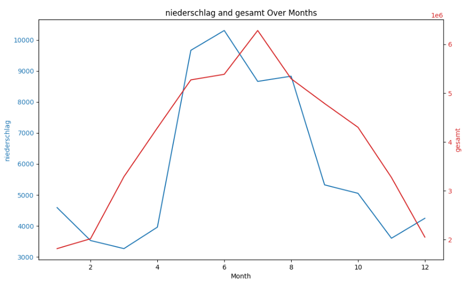
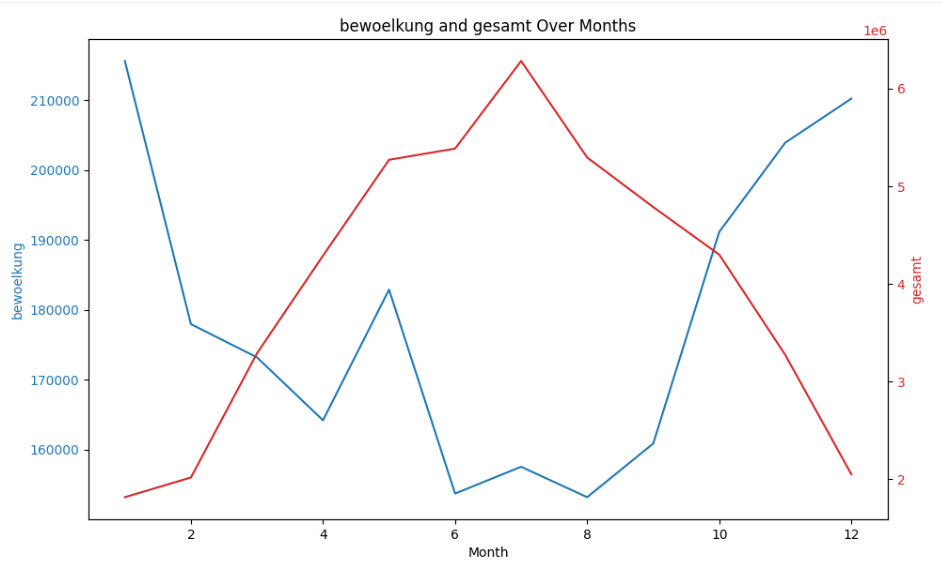
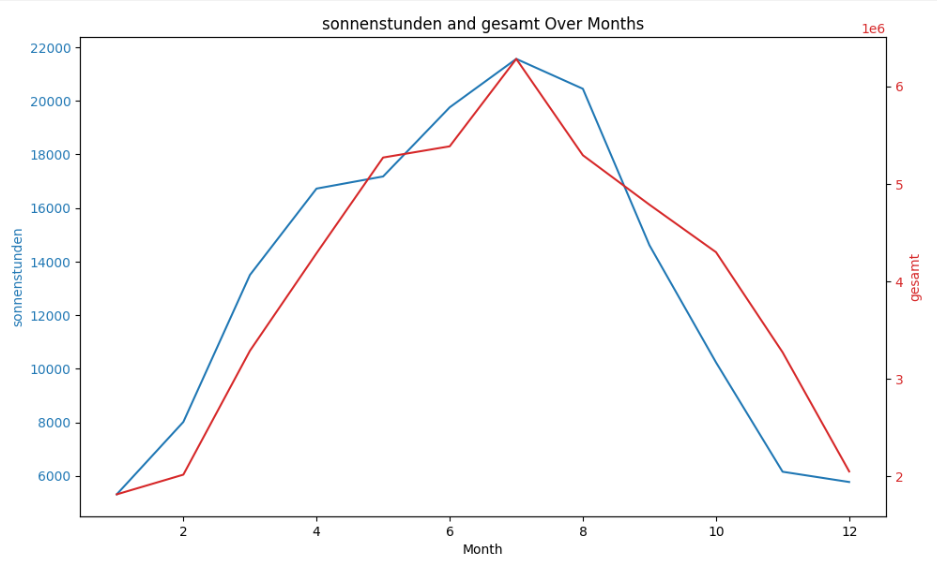

## Project Overview

The focal point of this project resides within the realm of urban planning and transportation, specifically forecasting cyclist traffic in Munich. Stemming from the city's open data initiative and the need to better understand and manage cyclist traffic based on various influencing factors, we will use machine learning to predict the expected number of cyclists on any given day. We will be considering weather forecasts and historical data for our prediction model.

The fundamental dataset for this project is derived from the Munich Bicycle Counting Stations. Established in 2008, these stations serve the purpose of monitoring the incrementing bicycle traffic in Munich on a continuous basis. Additional data sources have been categorized and stored in individual folders within the 'datasources' directory. Each of these folders not only contains the data but also detailed documentation and scripts or Jupyter notebooks to facilitate data download and preprocessing. For more specific details on the main dataset and its structure, please refer to the README in the respective dataset folder.

### Problem Statement

The task at hand is to develop a model that can predict the number of cyclists in Munich for a given day with reasonable accuracy. We aim to accomplish this by incorporating weather forecast data and historical cyclist count data. The end solution is expected to be a model that takes these inputs and outputs the predicted cyclist count. Such a model can assist the city's urban planning department in better understanding, managing, and making informed decisions about cyclist infrastructure and safety.

### Metrics

The primary performance metric for our model will be the Weighted Absolute Percentage Error (WAPE). The WAPE is a measure of prediction accuracy that specifically accounts for different levels of demand, which is ideal for our case due to the potentially fluctuating nature of cyclist counts.

The use of WAPE provides an intuitive and interpretable understanding of accuracy. It gives a clear representation of the average error rate, providing an easy-to-understand percentage error that can be communicated to stakeholders and used to guide decision-making.

## Data Analysis and Exploration

### Introduction

Before we can train our prediction model we need to clean the provided data and explore the data to understand the features of the Munich Bicycle data and their relevance to our overall goal, which is understanding bicycle usage patterns. In this chapter, we will present the features of our dataset, discuss any noteworthy characteristics, and visualize our findings.

### Data Exploration

The Munich Bicycle dataset contains quite some useful information for us to explore. It includes the following features:

* zaehlstelle: Identifier of the bicycle counting station.
* datum: The date of the count.
* richtung_1_x and richtung_2_x: Count of bicycles in two directions.
* gesamt: Total count of bicycles (the sum of richtung_1_x and richtung_2_x).
* min-temp and max-temp: Minimum and maximum temperature of the day.
* niederschlag: Amount of precipitation on that day.
* bewoelkung: Level of cloud cover.
* sonnenstunden: Number of hours of sunshine.
* zaehlstelle_lang: Long name of the counting station.
* latitude and longitude: Geographical location of the counting station.
* besonderheiten: Any special events or circumstances recorded on that day.

During the cleaning process, we noticed some inconsistencies in column names and different formats in the date fields, which we fixed. We also filled in missing values and deduplicated entries. The dataset now appears to be consistent, and all null values have been dealt with.

You can explore the cleaning process in detail in the Jupyter notebook `datasources/munich-bicycle-counting-stations/munich-bicycle-counting-stations-daily-data-cleaning.ipynb

### Feature Relevance and Statistics

Before we proceed with further analysis, we need to understand our features and calculate relevant statistics. The features in our dataset can be divided into three categories:

**Counting data**: These include richtung_1_x, richtung_2_x, and gesamt. These fields contain the number of bicycles counted at each station in a particular direction and the total count for the day.

**Weather data**: The dataset includes weather information such as min-temp, max-temp, niederschlag, bewoelkung, and sonnenstunden. These data can be crucial as weather conditions can significantly impact cycling habits.

**Station data**: Information related to the counting stations, including their ID, name, and geographical coordinates.

For each of these categories, we can calculate statistics such as mean, median, standard deviation, etc. For instance, we might be interested in the average daily count of bicycles (gesamt), the average temperature (min-temp and max-temp), or the average precipitation (niederschlag).

### Reducing the Scope

#### Simplifying the Target Variable

For this project we want to focus on determining the number of cyclists in Munich for a given day without breaking the estimates down to individual stations.

This helps us to facilitate the analysis and reduce the complexity of our model. We can achieve this by aggregating the data by date and summing up the individual counts of each station to a total sum over all stations. This will give us a single count for each day, which we can use as our target variable.

#### Choosing the Features

When choosing features we need to consider the following:

* **Relevance**: The feature should be relevant to our goal of predicting the number of cyclists.
* **Availability**: The feature should be available for the time period we are interested in.
* **Completeness**: The feature should be complete, i.e., it should not contain any missing values.
* **Consistency**: The feature should be consistent, i.e., it should not contain any outliers or other inconsistencies.
* **Forecastability**: The feature should be forecastable, i.e., we should be able to obtain a forecast for the feature for the time period we are interested in.

As all weather data in the bicycle data perfectly fulfills these criteria we setteled for the following features:

* **min-temp**: Minimum temperature of the day.
* **max-temp**: Maximum temperature of the day.
* **avg-temp**: Average temperature of the day.
* **niederschlag**: Amount of precipitation on that day.
* **bewoelkung**: Level of cloud cover.
* **sonnenstunden**: Number of hours of sunshine.

We can easily get these values from any weather forcasting api and then feed them into our model to get a prediction for the number of cyclists e.g. for the coming week.

### Data Visualization

Visualizing the target variable (gesamt) over time gives us a good overview of the data. We can see that the number of cyclists has been increasing over the years, while there is a steep increase from 2008 - 2014 the increase slows down a bit in the following years.

We can see a clear seasonal pattern in the data, with the number of cyclists being higher in the summer months and lower in the winter months. This is to be expected as the weather conditions are more favorable for cycling in the summer.

As the actual date is not imporant for the forecast, but the month we are currently in, we can simplify the date to the month. This will emphasize the seasonal pattern and make the model more robust.

We then can draw graphs of the target variable (gesamt) and the weather features (min-temp, max-temp, avg-temp, niederschlag, bewoelkung, sonnenstunden) over time. This will give us a good overview of the data and help us to identify any patterns or correlations.

**Min-Temp**

**Max-Temp**

**Avg-Temp**

**Niederschlag**

**Bewoelkung**

**Sonnenstunden**

We can see that all features we chose either are directly correlated to the number of cyclists or are inversely correlated. This is to be expected as the weather conditions have a direct impact on cycling habits.

