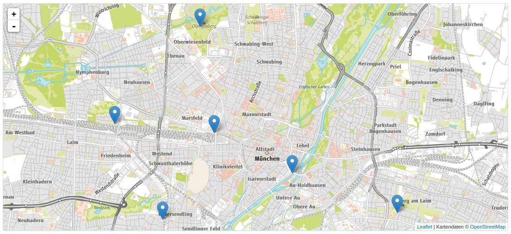

# Data from the bicycle counting stations in Munich



https://opendata.muenchen.de/dataset/raddauerzaehlstellen-muenchen

## Download full dataset

First we download the full dataset from the opendata portal of the city of Munich.

```
cd raw
python3 download_raw.py
```

## Filter data for daily data and check format

